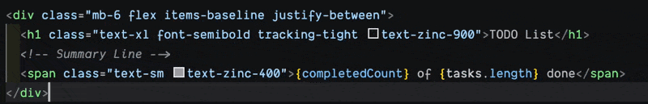
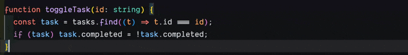

# Better Block Comments (BBC)

## Language support

Unlike other extensions, Better Block Comments works with **ANY** language that has block-comment syntax. No language-specific configuration needed. For purposes of this README, I will assume JS/TS for explanation sake.

## Javascript / Typescript Comment Types

```js
// I am a single line comment

/* I am a block comment and can span multiple lines */
```

## Maintains built in VSCode block comment functionality

- Multi-cursor support
- Appropriate selection adjustment after toggling/untoggling
- Undo stack similarly supported

## Additions to VS Code's built-in block comment

| Behaviour                              | VS Code built-in                                       | Better Block Comments                                                                                            |
| -------------------------------------- | ------------------------------------------------------ | ---------------------------------------------------------------------------------------------------------------- |
| Selection contains an existing `/* */` | Breaks — inner `*/` terminates the outer comment early | Safe — inner delimiters are augmented with `§` before wrapping, restored on unwrap                               |
| Language has no block comment syntax   | Does nothing                                           | Fallback toggles line comments (`//`, etc.) per line *(configurable)*                                            |
| One hotkey, context-aware behavior     | Two separate commands for line vs. block comments      | Single hotkey where existing selection triggers block comment, no selection triggers line comment (configurable) |
| Supports languages like Razor          | No                                                     | Yes — detects C# code blocks within `@{ }` Razor sections                                                        |

## The problem with nested comments

VS Code's **Toggle Block Comment** (`shift+alt+a`) breaks when your selection already contains a comment:



```js
// Before toggle (selection includes an existing comment):
const x = /* cached */ getValue();

// VS Code result — broken, inner */ ends the outer comment:
/* const x = /* cached */ getValue(); */

// Better Block Comments result — inner delimiters safely augmented:
/* const x = /§ cached §/ getValue(); */

// Toggle off — original fully restored:
const x = /* cached */ getValue();
```

## The benefits of enabling universal comment

One commenting hotkey always gives you what is logical based on context of selection/position on line.



```js
// Before: cursor anywhere in line (no selection)
let data = [1,2,3,4];
// After
// let data = [1,2,3,4];

// Before: cursor at end of line (no selection, universalComment.inlineEnd enabled) - cursor represented by |
let data = [1,2,3,4]; |
// After
let data = [1,2,3,4]; // |

// Before - selection of number[]
let data: number[] = [1,2,3,4];
// Becomes
let data /* number[] */ = [1,2,3,4];
```

## Usage

| Action               | Shortcut                                     |
| -------------------- | -------------------------------------------- |
| Toggle block comment | `cmd+alt+/` (Mac) / `ctrl+alt+/` (Win/Linux) |

It would be rude to overwrite the default VS Code keybinding for line comments (`cmd+/` / `ctrl+/`), but if this extension and Universal Comment align with your workflow, feel free.

`keybindings.json`

```JSON
{
  "key": "cmd+/",
  "command": "editor.action.blockComment",
  "when": "editorTextFocus"
}
```

## Settings

| Setting                                          | Default | Description                                                                                                                               |
| ------------------------------------------------ | ------- | ----------------------------------------------------------------------------------------------------------------------------------------- |
| `betterBlockComments.universalComment.enabled`   | `true`  | **Enabled**: no selection → line comment at beginning of line (indent aware). **Disabled**: no selection → inline block comment `/* */`.  |
| `betterBlockComments.universalComment.inlineEnd` | `true`  | Cursor at line end → `// ` appended inline instead of beginning of line. Toggle removes it. No effect when Universal Comment is disabled. |
| `betterBlockComments.lineCommentFallback`        | `true`  | **Enabled** - Languages not supporting Block Comments fallback as Line Comments. **Disabled** - performs no action (VSCode Default).      |

## Requirements

- VS Code 1.85.0 or later

## Known limitations

- The `§` character is used internally as an augmentation marker for block comments. It was chosen for its rarity across all language comment syntaxes and is not configurable.

## Author

Scott Rhamy — [github.com/cycle4passion](https://github.com/cycle4passion)
